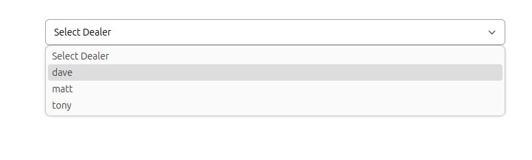
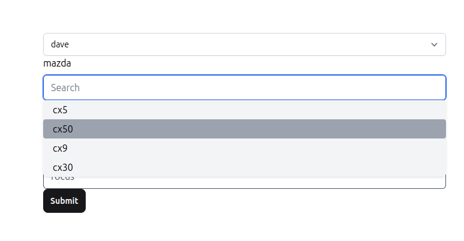
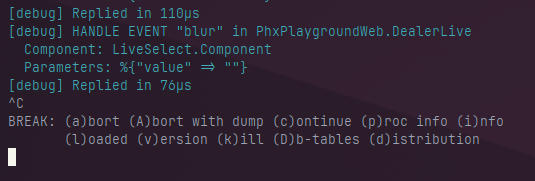
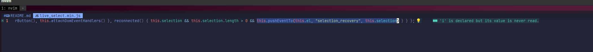
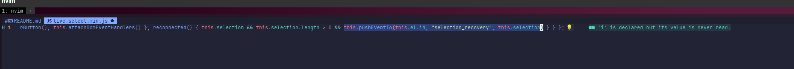

# live_select_example

This repo demonstrates an issue with live_select's selection_recover event.
All the necessary code is provided under `./lib/phx_playground_web/live/home`

Setup the repo with `mix setup`

## Steps to reproduce the issue

 * Run the server with `mix phx.server`
 * Select a dealer:

 

 * Select a car:

 

 * Abort phx.server:

 

 * Run `mix phx.server` to see the console spam that the parent LiveView has no
   function that handles event `selection_recovery`

## Steps to reproduce the fix

 * Modify the `reconnected()` callback in `./deps/live_select/priv/static/live_select.min.js` by changing `this.pushEventTo(...)`:

 > before

```javascript
reconnected() { this.selection && this.selection.length > 0 && this.pushEventTo(this.el, "selection_recovery", this.selection) }
```

 

 > after: call `this.el.id` instead of `this.el`

```javascript
reconnected() { this.selection && this.selection.length > 0 && this.pushEventTo(this.el.id, "selection_recovery", this.selection) }
```

 

 * Run `mix deps.compile`
 * Perform the same steps to reproduce the issue.
